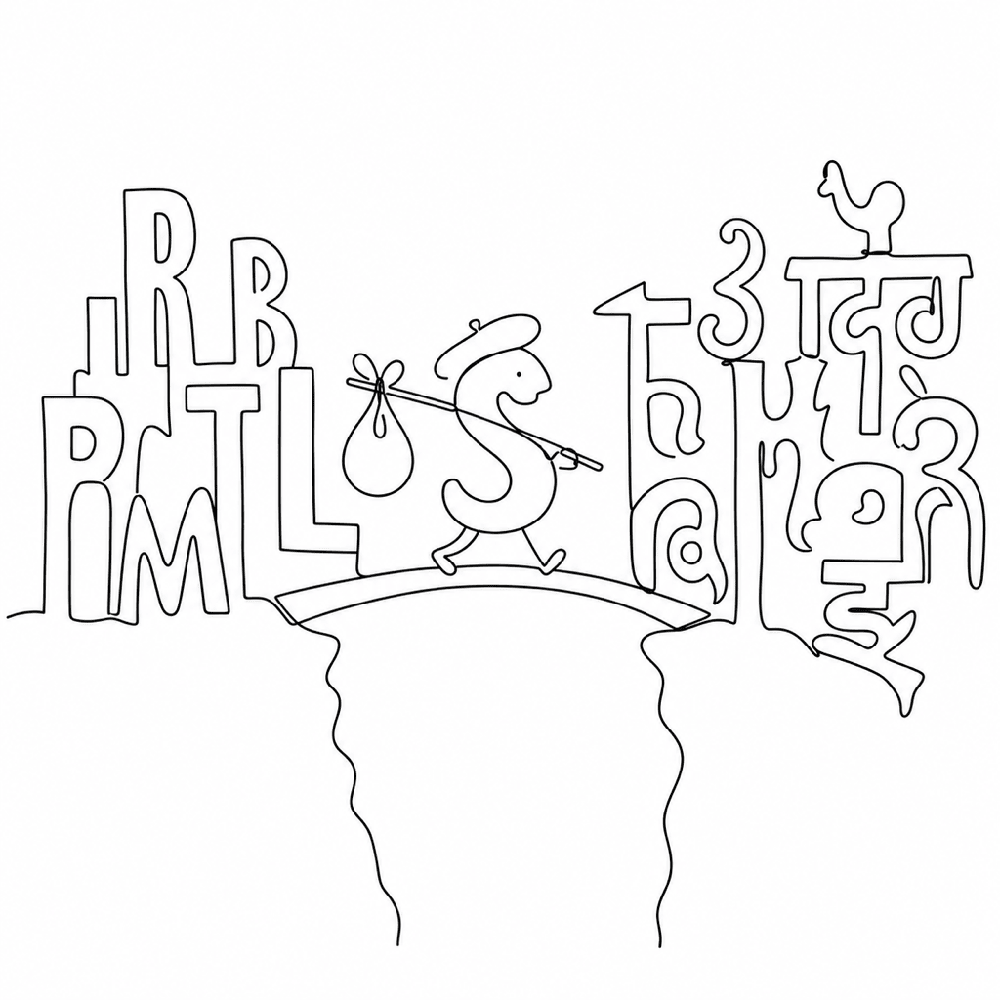

<!-- this_file: README.md -->

# Gimeltra

Type a word in Hebrew, read it back in Phoenician. Gimeltra transliterates
consonants between 24 mostly-Semitic writing systems, dropping vowels and marks
so the abjad skeleton carries across alphabets that never shared a keyboard.

No phonetic model, no vocalisation, no guesswork — one TSV of rules, Latin as
the pivot, and a fast per-character pass. Built for linguists, students of
ancient scripts, and developers who need programmatic transliteration.

## Visual



## Install

```sh
pip install gimeltra
```

Python 3.9+. Runtime dependencies: `fonttools` and `regex`.

## Quick start

Library:

```python
from gimeltra import tr

tr("שלום", sc="Hebr", to_sc="Latn")   # 'šlwm'
tr("bytk", sc="Latn", to_sc="Phnx")   # '𐤁𐤉𐤕𐤊'
tr("لرموز", to_sc="Hebr")             # 'לרמוז'  (source auto-detected)
```

Command line (`gimeltrapy`):

```sh
gimeltrapy -t "لرموز" -o Hebr        # לרמוز
echo "لرموز" | gimeltrapy -o Grek    # λρμυζ
gimeltrapy -i text.txt -o Narb       # read a file
gimeltrapy --stats                   # list every supported script
```

Scripts are named by their [ISO 15924](https://unicode.org/iso15924/) code
(`Hebr`, `Arab`, `Latn`, ...). Omit `-s` / the `sc` argument and Gimeltra
guesses the source from the text.

## How it works

Every conversion runs three passes:

1. **Preprocess** — decompose the input and strip all combining marks. Vowel
   points and diacritics are discarded here; this is what makes the transform
   abjad-only.
2. **Convert** — map each character source → target. When a script pair has no
   direct rule, the character pivots through Latin: source → Latin → target.
   That is why any of the 24 scripts can reach any other.
3. **Postprocess** — apply word-final letter forms and ligatures in the target
   script.

All rules live in one file, `gimeltra/gimeltra.tsv`, compiled to
`gimeltra_data.json` by `update.py`. See the
[rule format docs](docs/tsv-format.md) to add or edit a script.

Because vowels are dropped, the transform is lossy and not always reversible: a
script that folds two sounds onto one letter (Hebrew *bet* carries both *b* and
*v*) cannot recover the distinction on the way back.

## Supported scripts

Arabic, Imperial Aramaic, Brahmi, Chorasmian, Egyptian Hieroglyphs, Elymaic,
Ethiopic, Greek, Hatran, Hebrew, Latin, Manichaean, Old North Arabian,
Nabataean, Palmyrene, Inscriptional Pahlavi, Psalter Pahlavi, Phoenician,
Inscriptional Parthian, Samaritan, Old South Arabian, Sogdian, Old Sogdian,
Syriac, Ugaritic.

Full table with ISO 15924 codes: [docs/scripts.md](docs/scripts.md).

## CLI reference

| Option | Meaning |
|--------|---------|
| `-t, --text TEXT` | Text to transliterate |
| `-i, --input FILE` | Read input from a file |
| `-s, --script CODE` | Source script (ISO 15924); auto-detected if omitted |
| `-o, --to-script CODE` | Target script; defaults to `Latn` |
| `--stats` | List supported scripts |
| `-v, --verbose` | `-v` progress, `-vv` debug |
| `-V, --version` | Show version |

With no `-t` or `-i`, `gimeltrapy` reads from standard input.

## Development

```sh
git clone https://github.com/twardoch/gimeltra
cd gimeltra
./build.sh          # ruff + mypy + pytest + build
```

Tests, lint, and type-checks also run in CI across Python 3.9–3.13. To edit the
transliteration rules, change `gimeltra/gimeltra.tsv` and regenerate the data:

```sh
pip install "gimeltra[update]"
python -m gimeltra.update
```

## Notes and limitations

Gimeltra is a non-standard, simplified romanization scheme, not a scholarly
transliteration standard. It targets the consonantal skeleton and is best for
converting between abjads or into ancient scripts — not for phonetic accuracy or
faithful vocalised text.

## License

MIT. See [LICENSE](./LICENSE). By Adam Twardoch.
